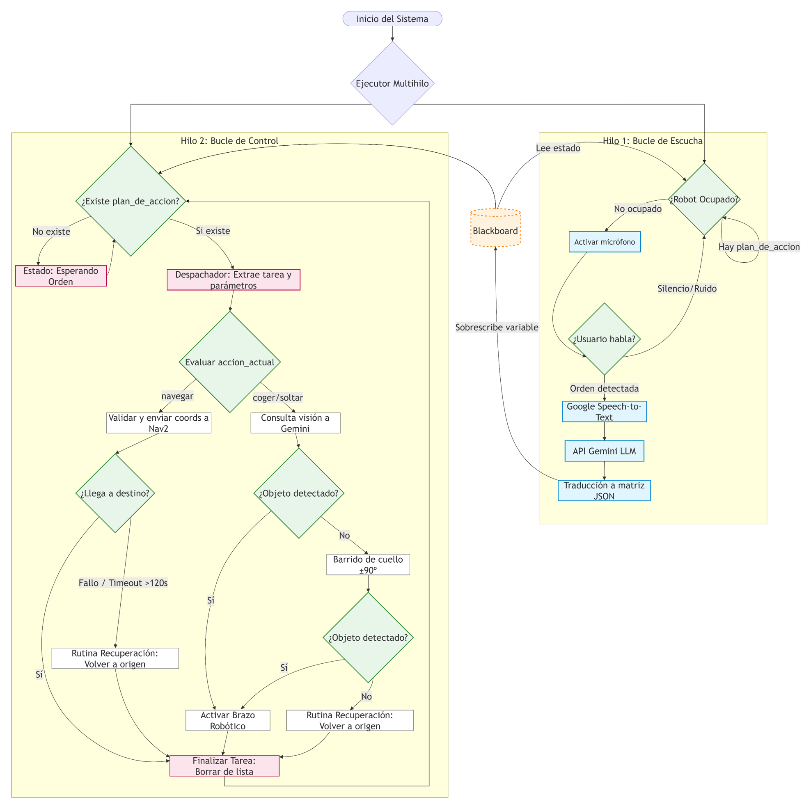

# Sancho: LLM-Assisted Mobile Manipulation System in ROS 2

This repository contains the software architecture for a **simulated** autonomous home assistant robot ("Sancho"). The core of this project bridges the gap between high-level natural language reasoning and low-level robotic execution by integrating **Large Language Models (LLMs)** with asynchronous **Behavior Trees** and the **Nav2** autonomous navigation stack.

Developed as a Final Degree Project (Trabajo Fin de Grado) in Electronics, Robotics, and Mechatronics Engineering at the University of Málaga (UMA).

##  Key Features

* **Semantic Reasoning:** Uses Google Gemini (Flash Lite) to interpret ambiguous natural language voice commands and translate them into structured JSON task sequences.
* **Asynchronous Control:** Implements a highly modular Behavior Tree using `py_trees`, executing control loops at 10 Hz without blocking the main ROS 2 thread during API calls or navigation timeouts.
* **Fault Tolerance:** Features built-in recovery behaviors (e.g., ±90º neck scans if an object is not detected) and automatic safe-return fallbacks if a target becomes unreachable.
* **Simulation-Ready:** Fully configured to interface with CoppeliaSim environments via ROS 2 topics and services.

---

##  System Architecture & Execution Flow

The architecture is divided into two mutually exclusive threads to guarantee real-time reactivity: an asynchronous listening loop (0.2 Hz) and the main Behavior Tree control loop (10 Hz). They communicate seamlessly through a shared global memory (Blackboard).

---
##  Descripción en Español:

Este repositorio contiene la arquitectura de software para un robot asistente del hogar autónomo **simulado** ("Sancho"). El núcleo de este proyecto acorta la brecha entre el razonamiento de alto nivel en lenguaje natural y la ejecución robótica de bajo nivel mediante la integración de **Modelos de Lenguaje Grande (LLMs)** con **Árboles de Comportamiento** asíncronos y el *stack* de navegación autónoma **Nav2**.

Desarrollado como Trabajo Fin de Grado en Ingeniería Electrónica, Robótica y Mecatrónica en la Universidad de Málaga (UMA).

##  Características Principales

* **Razonamiento Semántico:** Utiliza Google Gemini (Flash Lite) para interpretar comandos de voz ambiguos en lenguaje natural y traducirlos a secuencias de tareas estructuradas en formato JSON.
* **Control Asíncrono:** Implementa un Árbol de Comportamiento altamente modular utilizando `py_trees`, ejecutando bucles de control a 10 Hz sin bloquear el hilo principal de ROS 2 durante las llamadas a la API o los tiempos de espera (*timeouts*) de navegación.
* **Tolerancia a Fallos:** Cuenta con comportamientos de recuperación integrados (p. ej., barridos de cuello a ±90º si no se detecta un objeto) y rutinas automáticas de retorno seguro si un objetivo resulta inalcanzable.
* **Preparado para Simulación:** Totalmente configurado para interactuar con entornos de CoppeliaSim a través de tópicos y servicios de ROS 2.

---

##  Arquitectura del Sistema y Flujo de Ejecución

La arquitectura se divide en dos hilos mutuamente excluyentes para garantizar la reactividad en tiempo real: un bucle de escucha asíncrono (0.2 Hz) y el bucle de control principal del Árbol de Comportamiento (10 Hz). Ambos se comunican de forma fluida a través de una memoria global compartida (Blackboard).
